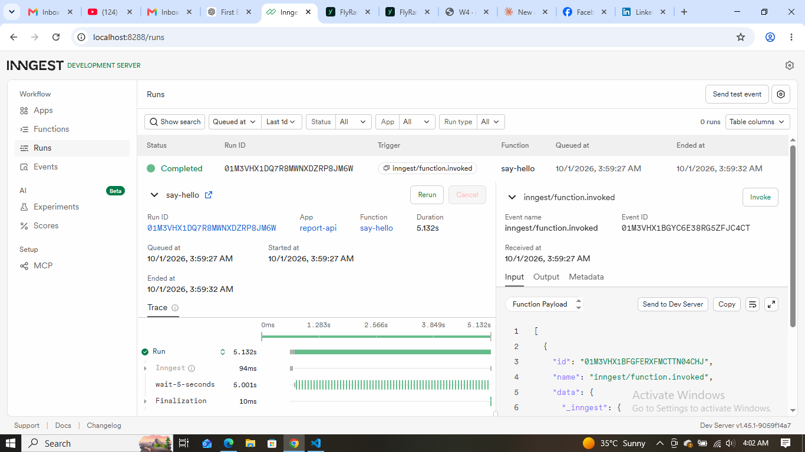
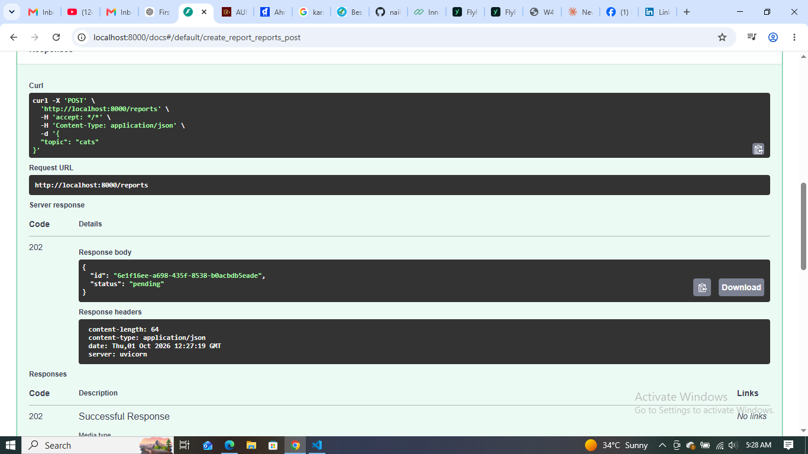
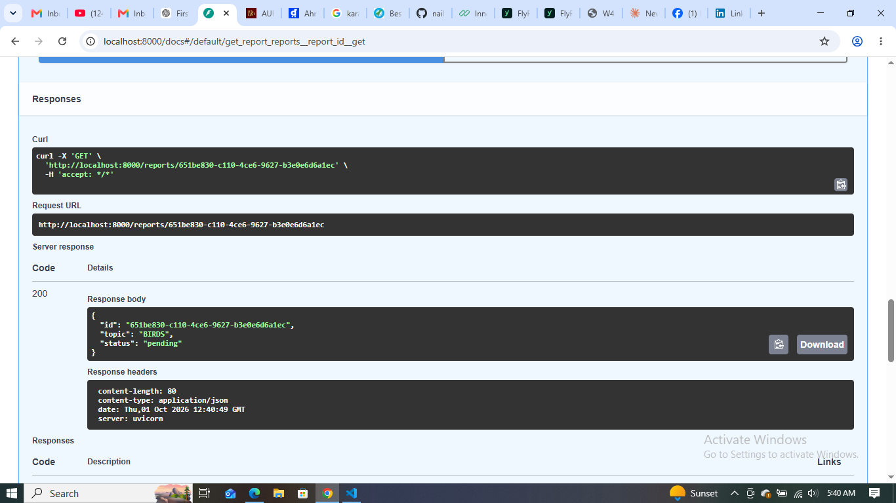
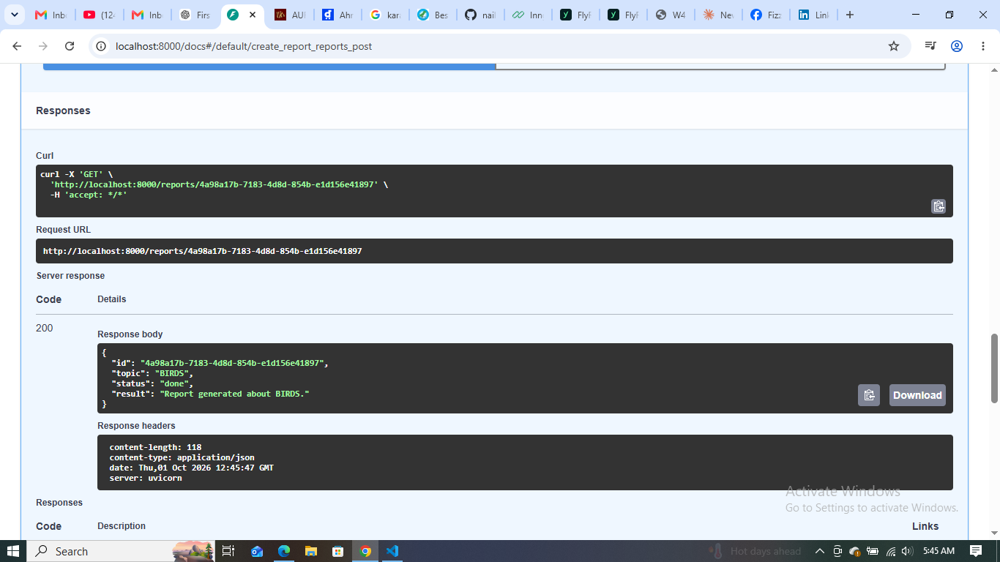
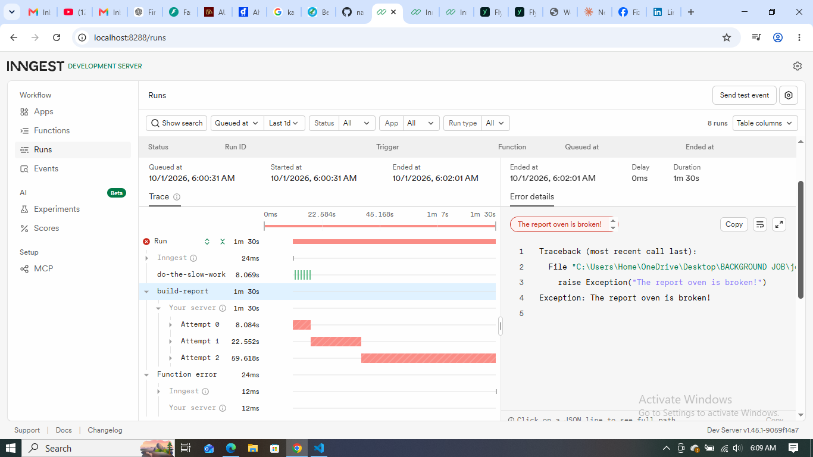
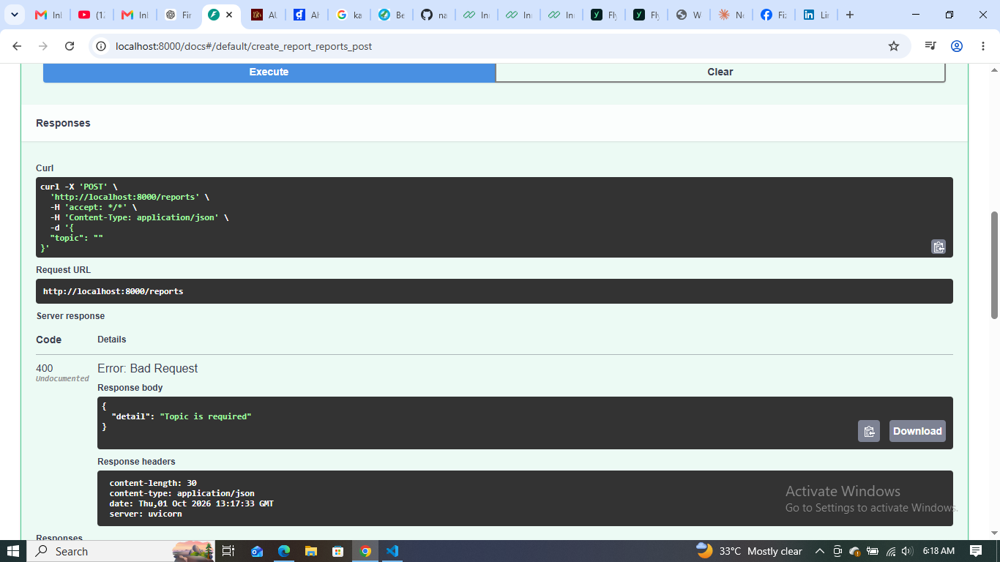
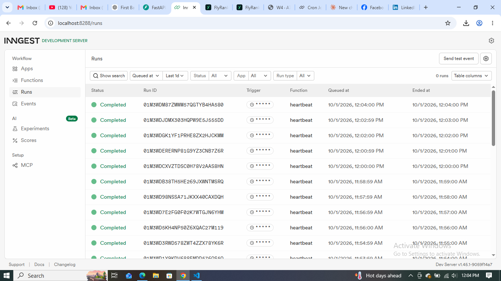
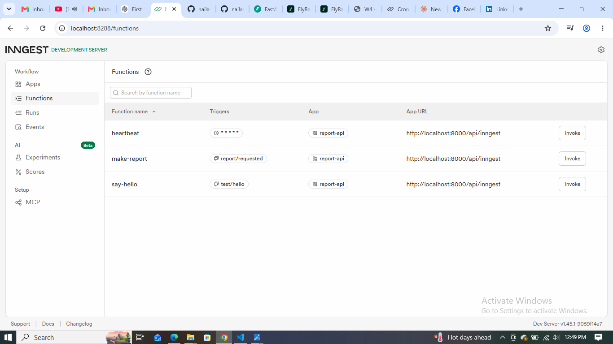

# Background Job with FastAPI and Inngest

## What This Is

This project demonstrates how to build background jobs using **FastAPI and Inngest**.

A report request is accepted immediately with a `202 Accepted` response, while the slow report generation runs in the background. The project also demonstrates **automatic retries for failed jobs** and a **cron-triggered heartbeat function**.

The project was built as part of the FlyRank Backend AI Engineering internship.

---

## How It Works

```text
Client
  |
  | POST /reports
  v
FastAPI
  |
  | Save report as "pending"
  | Send report/requested event
  v
Inngest
  |
  | Background job
  | Wait 8 seconds
  | Build report
  v
Report becomes "done"
  |
  | GET /reports/{id}
  v
Client receives result
```

The API does not wait for the slow background work to finish. Instead, it accepts the request, returns `202`, and allows the client to check the status later.

---

# Stage 1 — First Inngest Function

The first stage connects FastAPI with Inngest and creates a simple background function.

The `say-hello` function is triggered by the `test/hello` event and waits for 5 seconds using an Inngest step before returning a message.

### Function

```text
say-hello
Trigger: test/hello
Step: wait-5-seconds
```

### Proof Screenshot

**Screenshot: Stage 1 — Inngest Dashboard showing `say-hello` completed successfully**



---

# Stage 2 — 202 Accepted + Background Job

The second stage introduces the complete background-job pattern.

When the client sends:

```json
{
  "topic": "cats"
}
```

the API:

1. Generates a report ID.
2. Saves the report with `pending` status.
3. Sends the `report/requested` event to Inngest.
4. Immediately returns `202 Accepted`.
5. The `make-report` function performs the slow work in the background.
6. The report eventually changes to `done`.

### API Endpoints

| Method | Endpoint               | Purpose                                         |
| ------ | ---------------------- | ----------------------------------------------- |
| `POST` | `/reports`             | Create a report and start background processing |
| `GET`  | `/reports/{report_id}` | Check report status and result                  |
| `GET`  | `/health`              | Check that the API is running                   |

### Background Function

```text
make-report
Trigger: report/requested

Step 1: do-the-slow-work
        ↓
Step 2: build-report
        ↓
Report status: done
```

### Proof Screenshot 1

**Screenshot: Stage 2 — POST `/reports` returning `202 Accepted` with `pending` status**



### Proof Screenshot 2

**Screenshot: Stage 2 — First GET request showing report status `pending`**



### Proof Screenshot 3

**Screenshot: Stage 2 — Second GET request showing report status `done` with the generated result**



This demonstrates **polling** and **eventual consistency**: the client first sees `pending`, and later sees `done`.

---

# Stage 3 — Retries and Input Validation

Background jobs can fail because of temporary problems such as network failures or service interruptions.

The `make-report` function is configured with:

```python
retries=2
```

This means:

```text
Original attempt
      ↓
Retry 1
      ↓
Retry 2
      ↓
3 total attempts
```

For testing, the topic `fail` intentionally raises:

```text
The report oven is broken!
```

The dashboard can therefore show the failed run and its retry attempts.

### Proof Screenshot 1

**Screenshot: Stage 3 — `make-report` failed on the first attempt and retried**



### Proof Screenshot 2

**Screenshot: Stage 3 — `make-report` showing 3 total attempts and final Failed status**


### Input Validation

A missing topic is rejected at the API boundary:

```json
{}
```

returns:

```text
400 Bad Request
```

No Inngest event is sent for this invalid request.

**Invalid input is rejected immediately at the API boundary, while temporary failures during valid background work can be retried automatically.**

### Proof Screenshot 3

**Screenshot: Stage 3 — POST `/reports` with missing topic returning `400 Bad Request`**



---

# Stage 4 — Cron Heartbeat

The fourth stage introduces a scheduled background function.

The `heartbeat` function uses the cron expression:

```text
* * * * *
```

which means it runs **every minute**.

Each run counts the reports currently stored as:

```text
pending
done
failed
```

and logs a summary such as:

```text
Reports: pending=1, done=3, failed=0
```

There is no HTTP endpoint and no event required for this function. The **clock is the trigger**.

### Function

```text
heartbeat
Trigger: * * * * *
Schedule: Every minute
```

### Proof Screenshot 1

**Screenshot: Stage 4 — Inngest Dashboard showing the first `heartbeat` run**



### Proof Screenshot 2

**Screenshot: Stage 4 — Inngest Dashboard showing another `heartbeat` run one minute later**


### Cron Examples

The cron expression `0 8 * * *` runs every day at 08:00.

The cron expression `0 22 * * 0` runs every Sunday at 22:00.

---

# Stage 5 — Run the Project

## Requirements

* Python
* FastAPI
* Uvicorn
* Pydantic
* Inngest
* Node.js / npm for the Inngest Dev Server

---

## Terminal 1 — Start the FastAPI Application

From the project directory:

```powershell
$env:INNGEST_DEV="1"
python -m uvicorn job:app --reload --port 8000
```

The API will be available at:

```text
http://localhost:8000
```

Swagger documentation:

```text
http://localhost:8000/docs
```

---

## Terminal 2 — Start the Inngest Dev Server

Open a second terminal in the same project directory:

```powershell
npx inngest-cli@latest dev -u http://localhost:8000/api/inngest
```

The Inngest Dashboard will be available at:

```text
http://localhost:8288
```

---

# API Endpoints

| Method | Endpoint               | Description                                       |
| ------ | ---------------------- | ------------------------------------------------- |
| `GET`  | `/health`              | Returns the API health status                     |
| `POST` | `/reports`             | Creates a report and starts background processing |
| `GET`  | `/reports/{report_id}` | Returns the current report status/result          |

---

# Inngest Functions

| Function      | Trigger                  | Purpose                                               |
| ------------- | ------------------------ | ----------------------------------------------------- |
| `say-hello`   | `test/hello` event       | Demonstrates an event-triggered background function   |
| `make-report` | `report/requested` event | Performs slow report generation and retries failures  |
| `heartbeat`   | `* * * * *` cron         | Counts pending, done, and failed reports every minute |

---

# Proof — 202 Response and Polling

The following sequence demonstrates the main background-job flow.

## 1. Create a Report

Request:

```json
{
  "topic": "cats"
}
```

Expected response:

```text
202 Accepted
```

with:

```json
{
  "id": "<report-id>",
  "status": "pending"
}
```

**Proof Screenshot: Stage 5 — POST `/reports` returning `202 Accepted`**


---

## 2. First Poll

The client checks:

```text
GET /reports/<report-id>
```

The report is initially:

```json
{
  "id": "<report-id>",
  "topic": "cats",
  "status": "pending"
}
```

**Proof Screenshot: Stage 5 — First poll showing `pending`**


---

## 3. Second Poll

After the background job finishes:

```text
GET /reports/<report-id>
```

returns:

```json
{
  "id": "<report-id>",
  "topic": "cats",
  "status": "done",
  "result": "Report generated about cats."
}
```

**Proof Screenshot: Stage 5 — Second poll showing `done` and the result**


---

# Dashboard Proof

The Inngest Dashboard provides visual proof that the background functions actually ran.

The screenshots included with this project demonstrate:

* `say-hello` execution
* `make-report` background execution
* `make-report` retries and final failure
* `heartbeat` scheduled execution
* Multiple heartbeat runs occurring one minute apart

**Dashboard Screenshot: Stage 5 — Inngest Dashboard showing project runs**



---

# Key Concepts Demonstrated

### Background Jobs

Slow work does not have to block the HTTP request.

```text
HTTP Request
     ↓
FastAPI
     ↓
202 Accepted
     ↓
Background Job
     ↓
Result
```

### Polling

The client can repeatedly ask for the current status:

```text
pending → pending → done
```

### Eventual Consistency

The API response and the final background result do not become available at exactly the same time.

### Retries

A failed background job can be attempted again automatically.

```text
Attempt 1 → Failed
     ↓
Retry 1
     ↓
Retry 2
     ↓
Failed
```

### Cron Jobs

Some background work does not need a user request at all. It can run according to a schedule.

```text
Clock
  ↓
Cron Trigger
  ↓
heartbeat
  ↓
Report Summary
```

---

# Technologies

* Python
* FastAPI
* Pydantic
* Inngest
* Uvicorn
* Git / GitHub

---

# Project Structure

```text
BACKGROUND-JOB/
│
├── job.py
├── README.md
├── .gitignore
└── .venv/
```

The `.venv` directory is a local Python virtual environment and should not be committed to GitHub.

---

# Conclusion

This project demonstrates the basic architecture of a reliable background-job system: **FastAPI accepts the request, Inngest handles asynchronous work, retries failed jobs, and cron triggers scheduled work independently of HTTP requests.**
